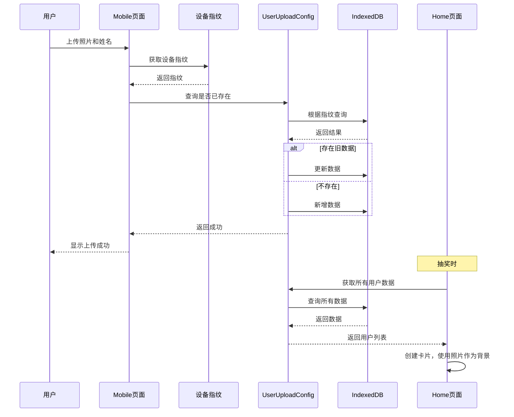

# 抽奖程序功能增强计划

## 📋 项目概述

基于现有的log-lottery抽奖应用，需要增加以下三个功能：

1. **手机端上传页面** - 允许用户上传照片和姓名
2. **卡片背景优化** - 使用用户上传的照片作为卡片背景，不显示文字
3. **中奖逻辑优化** - 已中奖的人不会继续中奖（已存在，需验证）

---

## 🎯 功能1: 手机端上传页面

### 需求详情
- 创建移动端上传页面
- 允许用户上传竖版照片
- 允许用户输入姓名
- 同一设备（IP、Cookies）重复上传会替换旧数据

### 技术方案

#### 1.1 修改Mobile页面结构
**文件：** `src/views/Mobile/index.vue`

**改动内容：**
- 移除弹幕发送相关代码
- 创建照片上传组件
- 创建姓名输入框
- 创建提交按钮
- 添加照片预览功能
- 添加上传状态提示

#### 1.2 创建设备指纹识别
**文件：** `src/utils/deviceFingerprint.ts`（新建）

**功能：**
- 使用FingerprintJS生成设备指纹
- 存储设备指纹到Cookies/LocalStorage
- 提供获取设备指纹的方法

#### 1.3 创建用户上传数据Store
**文件：** `src/store/userUploadConfig.ts`（新建）

**数据结构：**
```typescript
interface IUserUpload {
  id: string
  deviceFingerprint: string
  name: string
  photo: string | Blob
  createTime: string
  updateTime: string
}
```

**功能：**
- 存储用户上传的数据到IndexedDB
- 根据设备指纹查询用户数据
- 更新用户数据（同一设备重复上传）
- 获取所有用户上传数据

#### 1.4 创建API接口
**文件：** `src/api/userUpload/index.ts`（新建）

**接口：**
- `api_uploadUser(data)` - 上传用户数据
- `api_getUserByDevice(fingerprint)` - 根据设备指纹获取用户数据

#### 1.5 创建useViewModel
**文件：** `src/views/Mobile/useViewModel.ts`

**功能：**
- 处理照片上传逻辑
- 处理姓名输入逻辑
- 处理设备指纹获取
- 处理数据提交逻辑
- 处理重复上传替换逻辑

---

## 🎨 功能2: 卡片背景优化

### 需求详情
- 卡片使用用户上传的照片作为背景
- 不显示文字（姓名、部门等）

### 技术方案

#### 2.1 修改卡片渲染逻辑
**文件：** `src/hooks/useElement/index.ts`

**改动内容：**
- 修改`useElementStyle`函数
- 将照片设置为卡片背景图（`background-image`）
- 隐藏文字元素（`display: none`）
- 调整卡片样式以适应照片背景

#### 2.2 修改Home页面卡片创建逻辑
**文件：** `src/views/Home/useViewModel.ts`

**改动内容：**
- 在`initThreeJs`函数中修改卡片创建逻辑
- 移除文字元素的创建（或隐藏）
- 确保照片正确加载和显示

#### 2.3 添加照片加载状态处理
**文件：** `src/views/Home/useViewModel.ts`

**功能：**
- 处理照片加载失败的情况
- 提供默认照片或占位图

---

## ✅ 功能3: 中奖逻辑优化

### 需求详情
- 已中奖的人不会继续中奖

### 技术方案

#### 3.1 验证现有逻辑
**文件：** `src/store/personConfig.ts`

**验证点：**
- `getNotPersonList`是否正确过滤`isWin=true`的人员
- `addAlreadyPersonList`是否正确标记中奖人员
- 抽奖逻辑中`personPool`是否从`notPersonList`获取

**预期结果：**
- 功能已存在，应该正常工作
- 如有问题，需要修复

---

## 📁 文件结构

### 新建文件
```
src/
├── utils/
│   └── deviceFingerprint.ts          # 设备指纹识别工具
├── store/
│   └── userUploadConfig.ts           # 用户上传数据Store
├── api/
│   └── userUpload/
│       └── index.ts                  # 用户上传API接口
├── views/
│   └── Mobile/
│       └── components/
│           └── PhotoUpload.vue       # 照片上传组件（可选）
```

### 修改文件
```
src/
├── views/
│   └── Mobile/
│       ├── index.vue                 # 修改为照片上传页面
│       └── useViewModel.ts           # 添加上传逻辑
├── hooks/
│   └── useElement/
│       └── index.ts                  # 修改卡片渲染逻辑
└── views/
    └── Home/
        └── useViewModel.ts           # 修改卡片创建逻辑
```

---

## 🔧 实施步骤

### 阶段1: 设备指纹识别
1. 创建`src/utils/deviceFingerprint.ts`
2. 实现设备指纹生成逻辑
3. 实现设备指纹存储逻辑

### 阶段2: 用户上传数据Store
1. 创建`src/store/userUploadConfig.ts`
2. 定义数据结构
3. 实现数据存储和查询方法

### 阶段3: API接口
1. 创建`src/api/userUpload/index.ts`
2. 定义API接口方法

### 阶段4: Mobile页面改造
1. 修改`src/views/Mobile/index.vue`
2. 创建照片上传UI
3. 创建姓名输入UI
4. 实现提交逻辑

### 阶段5: useViewModel实现
1. 修改`src/views/Mobile/useViewModel.ts`
2. 实现照片上传处理
3. 实现姓名输入处理
4. 实现设备指纹获取
5. 实现数据提交和替换逻辑

### 阶段6: 卡片背景优化
1. 修改`src/hooks/useElement/index.ts`
2. 实现照片背景设置
3. 隐藏文字元素

### 阶段7: Home页面卡片创建
1. 修改`src/views/Home/useViewModel.ts`
2. 调整卡片创建逻辑
3. 添加照片加载处理

### 阶段8: 验证和测试
1. 验证中奖逻辑
2. 测试照片上传功能
3. 测试重复上传替换功能
4. 测试卡片背景显示
5. 测试整体功能

---

## 📊 数据流程图



---

## ⚠️ 注意事项

1. **照片大小限制**
   - 建议限制照片大小（如5MB以内）
   - 建议限制照片尺寸（如最大2000x3000）

2. **照片格式**
   - 支持常见格式：jpg, jpeg, png, webp
   - 建议转换为统一格式存储

3. **设备指纹**
   - FingerprintJS生成的指纹可能在某些情况下变化
   - 建议同时使用Cookies作为辅助识别

4. **照片加载**
   - 照片可能加载失败，需要提供默认图片
   - 考虑使用懒加载优化性能

5. **IndexedDB存储**
   - IndexedDB有存储大小限制（通常50MB-250MB）
   - 需要监控存储使用情况

6. **兼容性**
   - 确保移动端页面在主流浏览器上正常显示
   - 考虑响应式设计

---

## 🎯 验收标准

### 功能1: 手机端上传页面
- [ ] 可以正常打开Mobile页面
- [ ] 可以上传竖版照片
- [ ] 可以输入姓名
- [ ] 同一设备重复上传会替换旧数据
- [ ] 上传成功后显示提示
- [ ] 照片预览正常显示

### 功能2: 卡片背景优化
- [ ] 卡片使用用户上传的照片作为背景
- [ ] 卡片不显示文字
- [ ] 照片加载失败时显示默认图片
- [ ] 卡片样式美观

### 功能3: 中奖逻辑优化
- [ ] 已中奖的人不会继续中奖
- [ ] 中奖人员正确标记
- [ ] 未中奖人员可以继续参与抽奖

---

## 📝 后续优化建议

1. **照片压缩**
   - 上传时自动压缩照片
   - 减少存储空间占用

2. **照片裁剪**
   - 提供照片裁剪功能
   - 确保照片比例一致

3. **批量上传**
   - 支持批量上传用户数据
   - 适用于管理员批量导入

4. **数据导出**
   - 支持导出用户上传数据
   - 便于数据备份

5. **照片审核**
   - 管理员可以审核上传的照片
   - 拒绝不合适的照片

---

## 🔗 相关资源

- [FingerprintJS文档](https://github.com/fingerprintjs/fingerprintjs)
- [IndexedDB API](https://developer.mozilla.org/en-US/docs/Web/API/IndexedDB_API)
- [Vue3官方文档](https://vuejs.org/)
- [Three.js官方文档](https://threejs.org/)
