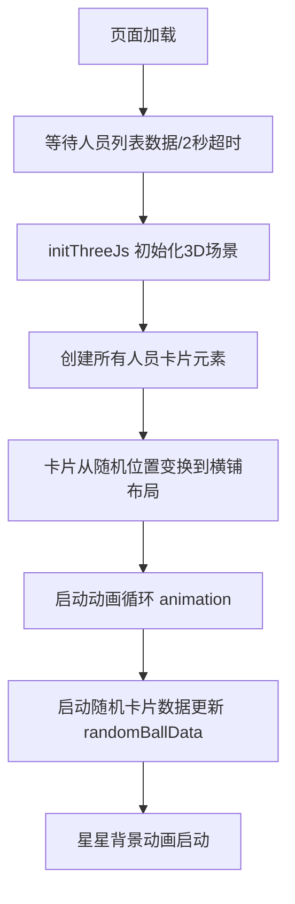

根据代码分析，这个项目的首页打开时会触发以下动画：

## 首页初始化动画流程

## 具体触发的动画

### 1. **Three.js 3D 卡片变换动画** ([`useViewModel.ts:183`](src/views/Home/useViewModel.ts:183))
- **动画类型**：Tween 补间动画
- **持续时间**：1000ms（1秒）
- **缓动函数**：`Exponential.InOut`
- **效果**：所有卡片从随机位置（x: -2000~2000, y: -2000~2000, z: -2000~2000）平滑移动到横铺布局的网格位置
- **同时动画**：位置和旋转同时进行

### 2. **星星背景动画** ([`StarsBackground/index.vue:67`](src/views/Home/components/StarsBackground/index.vue:67))
- **动画库**：Sparticles
- **星星数量**：100颗
- **动画效果**：
  - `parallax: 1.2` - 视差效果
  - `rotate: true` - 星星旋转
  - `twinkle: true` - 星星闪烁
  - `speed: 10` - 动画速度
- **响应式**：窗口大小改变时重新计算（200ms 节流）

### 3. **随机卡片数据更新动画** ([`useViewModel.ts:907`](src/views/Home/useViewModel.ts:907))
- **触发频率**：每 500ms
- **更新数量**：每次随机更新 2 张卡片
- **效果**：卡片上的姓名、部门等信息会随机变化，营造抽奖氛围
- **实现方式**：使用 `setInterval` 定时器

### 4. **持续渲染循环** ([`useViewModel.ts:905`](src/views/Home/useViewModel.ts:905))
- **动画类型**：`requestAnimationFrame` 循环
- **帧率限制**：60fps（每帧间隔 16.67ms）
- **功能**：
  - 更新 TWEEN 动画状态
  - 更新控制器状态
  - 渲染 3D 场景

### 5. **TrackballControls 控制器动画** ([`useViewModel.ts:106-111`](src/views/Home/useViewModel.ts:106-111))
- **功能**：允许用户通过鼠标拖拽旋转场景
- **参数**：
  - `rotateSpeed: 1` - 旋转速度
  - `minDistance: 500` - 最小距离
  - `maxDistance: 6000` - 最大距离
- **交互**：用户操作时触发实时渲染

## 动画执行顺序

1. **第 0-1000ms**：卡片从随机位置飞入到横铺布局
2. **第 500ms 开始**：卡片数据开始随机更新（每 500ms 一次）
3. **持续运行**：星星背景动画和渲染循环
4. **用户交互**：鼠标拖拽可旋转查看 3D 场景

## 性能优化

从代码中可以看到以下优化措施：
- 星星数量从 200 减少到 100（[`StarsBackground/index.vue:25`](src/views/Home/components/StarsBackground/index.vue:25)）
- 随机卡片更新频率从 200ms 提高到 500ms（[`useViewModel.ts:736`](src/views/Home/useViewModel.ts:736)）
- 每次更新的卡片数量从 4 个减少到 2 个（[`useViewModel.ts:738`](src/views/Home/useViewModel.ts:738)）
- 渲染循环限制为 60fps（[`useViewModel.ts:79`](src/views/Home/useViewModel.ts:79)）
- 窗口大小改变使用 200ms 节流（[`StarsBackground/index.vue:42`](src/views/Home/components/StarsBackground/index.vue:42)）

这些动画共同营造了一个动态、互动的抽奖首页体验。